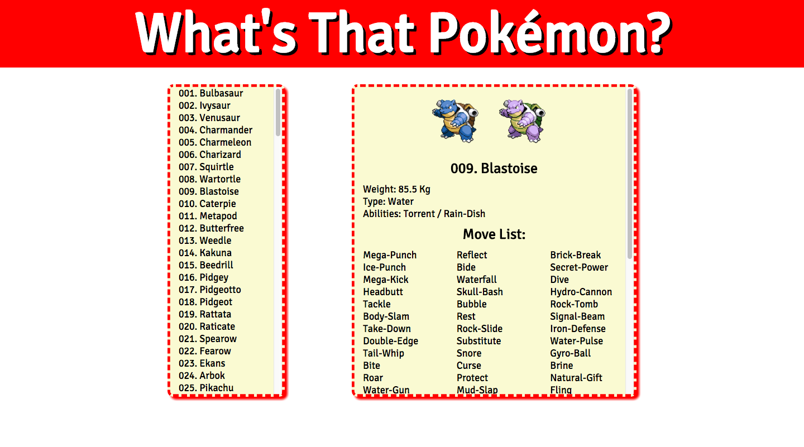

# What's That Pokemon?
> A browser application using the PokéAPI to render information about the first 151 Pokémon.

[![NPM Version][npm-image]][npm-url]
[![Build Status][travis-image]][travis-url]

	https://yamilburgos.github.io/WhatThatPokemon



## Installation & Instructions
OS X & Linux:

```sh
npm install --save
npm start
```

## Mockup:


## Information:

An app that renders the names of the first 151 Pokémon in the pokéapi database on page load. When the user clicks a name, the app should render information about that Pokémon, including the name and weight.

## Meta
[Yamil Burgos](https://github.com/yamilburgos/) – yamil.burgos1293@gmail.com

[PokeApi](https://pokeapi.co/)

## Contributing
1. Fork it (<https://github.com/yamilburgos/WhatThatPokemon/fork>)
2. Create your feature branch (`git checkout -b feature/fooBar`)
3. Commit your changes (`git commit -am 'Add some fooBar'`)
4. Push to the branch (`git push origin feature/fooBar`)
5. Create a new Pull Request

<!-- Markdown link & img dfn's -->
[npm-image]: https://img.shields.io/npm/v/datadog-metrics.svg?style=flat-square
[npm-url]: https://npmjs.org/package/datadog-metrics
[travis-image]: https://img.shields.io/travis/dbader/node-datadog-metrics/master.svg?style=flat-square
[travis-url]: https://travis-ci.org/dbader/node-datadog-metrics