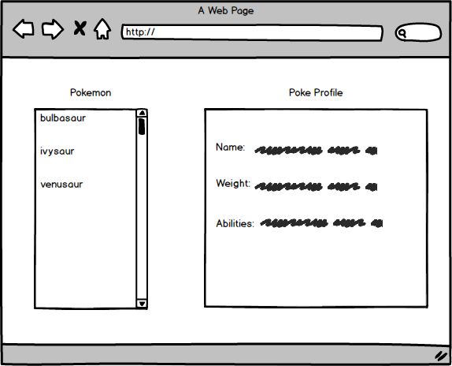

# PokéApp

Over the next three days, you will be building a Pokémon app in **React** using this super neat, super free [PokeApi](https://pokeapi.co/)!

## Here's your mockup:

## Here's your mission:

Build an app that renders the names of the first 151 Pokémon in the pokéapi database on page load.  When the user clicks a name, the app should render information about that Pokémon, including the name and weight.

## Deliverables

1. Using all of the knowledge you learned today about project management workflow, complete the following steps before jumping into a line of code:
  - Wireframe the mock up above, <a href="https://facebook.github.io/react/docs/thinking-in-react.html">React Docs style.</a>
  - Write user stories to match with the functionality.
  - Break down the user stories into steps to code.

2. Tackle app above with React. Make sure to write clean code, with frequent git commits (we should be able to view the story of building your app based on your commits).

3. Style that puppy and make it look goooooood.

4. Make sure to deploy your app on a platform of your choice.

## Bonus

Feeling like a rockstar? Add the Pokémon's abilities to the rendered profile (see mockup above).
